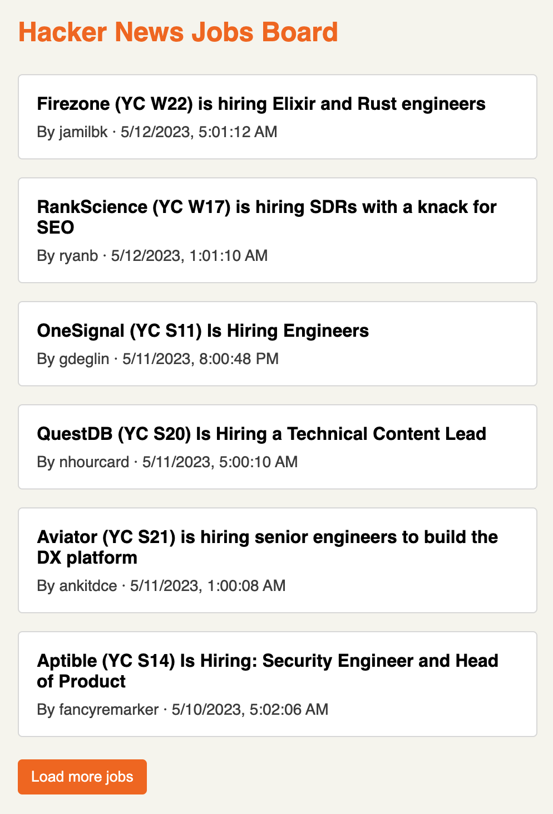

# No 2. Job Board

## 문제 링크

- [GreatFrontEnd - Job Board](https://www.greatfrontend.com/questions/user-interface/job-board?language=js&tab=coding)

<br />

## 문제 설명

Hacker News API에서 가져온 최신 채용 공고를 표시하는 구인 게시판을 구축하세요. 각 공고에는 직책, 게시자 및 게시 날짜가 표시됩니다.



<br />

## 요구 사항

- 페이지가 처음 로드될 때 6개의 채용 공고가 표시되고, 더 많은 공고를 불러오는 버튼이 있어야 합니다.
- "더 보기" 버튼을 클릭하면 다음 페이지의 6개 공고가 로드됩니다. 더 이상 로드할 공고가 없으면 버튼이 표시되지 않습니다.
- 채용 공고 상세 정보에 URL 필드가 있는 경우, 채용 공고 제목을 클릭하면 새 창에서 채용 공고 상세 페이지가 열리는 링크로 만들어야 합니다.
- 타임스탬프는 원하는 형식으로 표시할 수 있습니다.

<br />

## API

Hacker News는 Y Combinator 기업의 채용 정보를 가져오는 공개 API를 제공합니다. 하지만 채용 정보 목록과 관련 데이터를 한 번에 가져오는 API는 없으므로, 필요한 데이터를 각각 요청하여 결합한 후 표시해야 합니다.

### 채용 정보(Job Stories)

채용 공고 ID 목록을 가져옵니다.

- URL: https://hacker-news.firebaseio.com/v0/jobstories.json
- HTTP Method: `GET`
- Content Type: `json`

예시 응답:

```
[35908337, 35904973, 35900922, 35893439, 35890114, 35880345, ...]

```

### 채용 상세 정보(Job Details)

ID를 사용하여 채용 공고의 세부 정보를 가져옵니다.

- URL: `https://hacker-news.firebaseio.com/v0/item/{id}.json`
- HTTP Method: `GET`
- Content Type: `json`

https://hacker-news.firebaseio.com/v0/item/35908337.json에 대한 예시 응답:

```
{
  "by": "jamilbk",
  "id": 35908337,
  "score": 1,
  "time": 1683838872,
  "title": "Firezone (YC W22) is hiring Elixir and Rust engineers",
  "type": "job",
  "url": "https://www.ycombinator.com/companies/firezone/jobs"
}
```

<br />

## 참고

- 이 질문의 초점은 기능에 있으며 스타일은 고려하지 않지만, 페이지를 보기 좋게 꾸미는 것은 자유입니다.
- 사용자 경험을 개선하고 데이터 과다 가져오기를 방지하려면 페이지에 표시되는 채용 공고 수만큼만 채용 공고 세부 정보를 가져오도록 제한하는 것이 좋습니다.

<br />

## 제공된 기본 코드

```javascript
import { useState } from 'react';

export default function App() {
  const [message, setMessage] = useState('Hello World!');

  return <div>{message}</div>;
}
```

```css
body {
  font-family: sans-serif;
}
```
